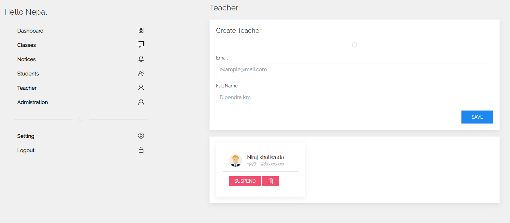
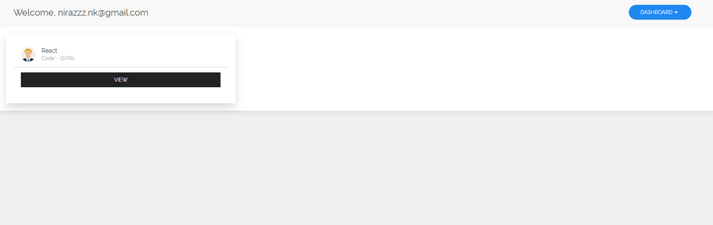
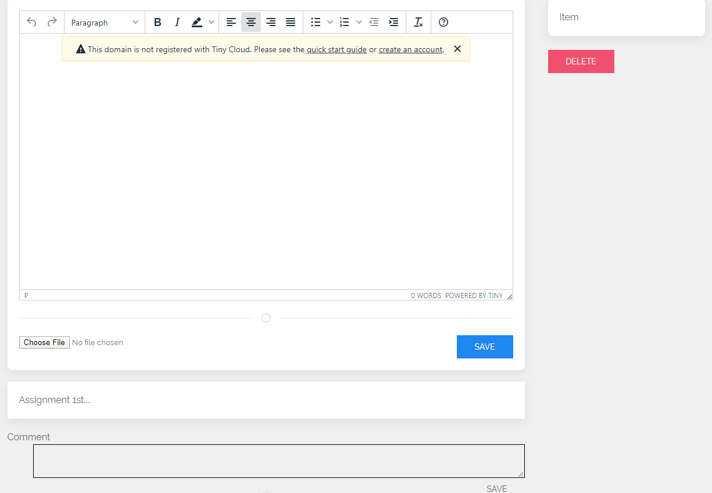
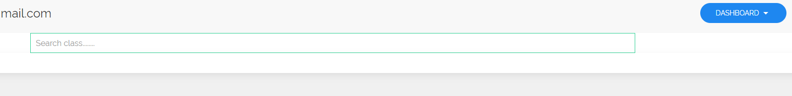

# Learning Management System (LMS)

Consists of 3 types of users, Manager, Teachers and Students. Manager is created by admin and Teachers and Students can only be added by Manager. When new teacher or student is added by manager, they will receive an email to change the password and log in to the system.

### Add Teacher and Students from manager account 

### Teacher Dashboard 

### Class creation

### Add Assignments

### Student dashboard
Students search through the class and send request to join the class. Teacher verifies that the student sending request is registered for the class.

